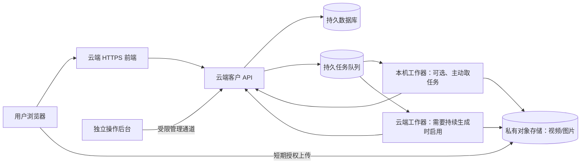

# 持续可用方案：云端接收，异步建模

更新：2026-10-05。此文件是**目标架构和迁移清单**，当前代码尚未实现。原有 SSH 反向隧道只适合联调：Mac 休眠、关机或断网时，登录、上传和查询都会中断，不能作为持续可用的正式入口。

**已确认的项目目标：登录、上传和查进度始终可用；建模可以排队等待本机工作器。** 因此第一阶段采用“云端接收 API + 云端持久数据 + 本机主动取任务”的方案。云端常驻建模工作器是将来需要持续处理时的扩展，不是本阶段上线前提。

交给服务器端开发同事的具体任务与验收清单见[云端改造任务书](CLOUD_COLLEAGUE_HANDOFF_ZH.md)。

## 可用性目标要分开定义

1. **接收服务持续可用**：用户随时能打开网站、登录、上传视频、查看任务状态；计算资源暂时不可用时，任务可靠排队，页面明确显示等待处理。
2. **生成服务持续处理**：视频质检、COLMAP、混元、保护套适配也不依赖 Mac。若需要这一层，所有必需的工作器都要运行在云端或其他受监控的常驻计算节点，并准备故障恢复。

不存在单机或单条隧道能绝对保证零中断。上线验收应约定可用性目标、恢复时间、数据恢复点、监控与告警，而不是仅确认进程能启动。

## 推荐拓扑

- **云端必须常驻**：用户静态站、客户 API、登录/会话、任务数据库、私有视频存储、队列及其状态查询。API 返回“已接收/排队中”，不等待三维计算完成。
- **本机可以保留**：COLMAP、Blender、WorkBuddy 等重计算工作器。它们主动从云端领取任务、下载被授权的视频、上传结果；本机离线时任务留在队列。用户仍可登录、上传和查进度。
- **若要求生成不停机**：把本机工作器迁到云端常驻节点，或准备同等能力的备用节点。混元调用也由队列驱动，记录远端任务 ID、重试次数、回调/轮询状态和最终产物。
- **操作后台仍独立**：使用独立管理入口与正式管理员身份验证，只通过 VPN、私有网络或等效受限通道访问；不要把 `/operator/` 和 `/api/internal/*` 放在客户公开站点。

## 当前代码不能直接搬过去的原因

| 当前实现 | 迁移要求 |
| --- | --- |
| `../forme-backend/src/forme_backend/store.py` 使用本机 SQLite 与会话表 | 改为可备份的云端数据库；数据库迁移、唯一约束和任务所有权需保留 |
| `api.py` 将视频写到 `FORME_DATA_DIR/uploads/`，最多 512 MiB | 改为私有对象存储；客户 API 签发限定对象键、方法、类型、大小和有效期的短期上传授权，完成后校验实际大小/哈希 |
| 提交后用 FastAPI `BackgroundTasks` 做质检 | 改为持久任务队列；API 进程重启不应丢任务，工作器需幂等领取、超时重试和失败记录 |
| `model_worker.py` 与 `cover_automation.py` 假设本机文件路径、COLMAP 可执行文件和工作区模板目录 | 为工作器定义版本化输入清单、对象存储键、单位/坐标及产物清单；模板库也要有可部署来源 |
| 共享密钥每次登录创建新会话，旧任务无法通过新会话找回 | 正式上线前建立用户身份、任务归属和管理员角色；至少先定义找回与撤销流程 |
| `dist/js/create-workflow.js` 用同源 `/api/uploads/...` 上传 | 保留用户流程，适配新的初始化/分片上传/完成协议；视频可直接传对象存储，避免云服务器磁盘和反向隧道承载完整文件 |

对象存储和队列可以选择云服务商的兼容产品，不限定具体供应商。以 S3/SQS 为例，官方文档分别说明[限时预签名上传](https://docs.aws.amazon.com/AmazonS3/latest/userguide/PresignedUrlUploadObject.html)和[持久队列解耦](https://docs.aws.amazon.com/AWSSimpleQueueService/latest/SQSDeveloperGuide/)；这些链接说明技术机制，不表示项目必须使用 AWS。

## 实施顺序与验收

1. **固定代码与数据边界**：后端建立受控仓库或部署包，排除 `data/`、API 凭据、视频及私人模型；列出本机模板库和运行依赖。确定云服务商、区域、域名、预计视频量及保留期限。
2. **先做云端接收链**：部署客户 API、数据库和私有对象存储，迁移登录、上传、提交、任务列表接口；前端保持同源 `/api/customer/*`，上传改成短期授权直传或受控分片上传。云端不依赖 Mac 也必须完成这些请求。
3. **接入队列与工作器**：提交后写入持久队列；工作器取任务前校验来源哈希，按阶段回写状态；断网、重复消息或进程重启不能重复收费、重复生成或丢任务。
4. **迁移操作后台**：独立受限入口读取同一云端任务库；人工审核、错误重试及产物查看有审计记录。
5. **决定生成可用性等级**：若仅要求接收 24/7，本机工作器可离线排队；若要求持续出结果，部署云端 COLMAP/Blender 工作器及备用能力。混元、标尺定尺度、几何门禁和人工审批按实际阶段接入。
6. **故障演练**：关掉 Mac，仍能登录、上传、查到“等待处理”；重启 API 不丢任务；对象存储和数据库可从备份恢复；云端工作器故障有告警和重试。只有这一步通过，才撤掉生产链对 SSH 隧道的依赖。

## 给服务器端 Claude Code 的边界

目前本 GitHub 仓库只有静态前端。服务器端 Claude Code **不能仅凭本仓库完成云端后端迁移**；它还需要经过授权的后端代码交付、目标云服务配置及密钥管理方式。不得把开发电脑的 `data/`、`.customer-access-key`、腾讯云/视觉 API 密钥直接提交或复制到公开前端仓库。现有 `deploy/CLAUDE_DEPLOY.md` 的隧道方案只用于短期联调，不满足本文件的持续可用目标。
