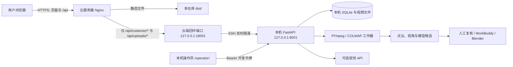
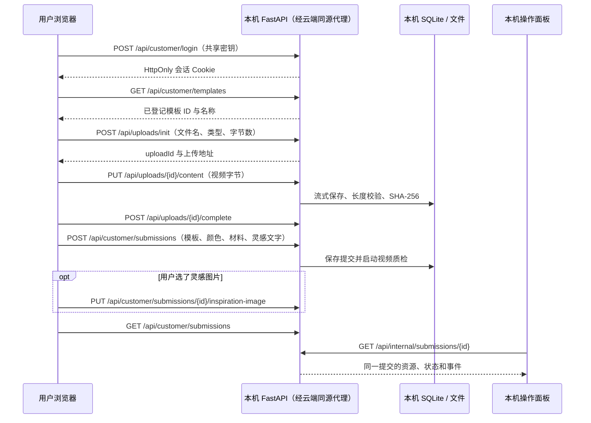

# Forme 前后端系统说明与实现路径

更新：2026-10-05。本文按当前代码和本机工作区编写，描述**已经实现的行为**与**下一步实施路径**。它不是已上线或已完成实物贴合的声明。

> **部署目标更新：**登录、上传和查进度须持续可用；建模允许排队。本文第 1、5 节的 SSH 隧道是当前原型，不满足目标。正式迁移方案见[云端接收与异步建模](../deploy/ALWAYS_ON_ARCHITECTURE_ZH.md)。

## 1. 仓库边界与总体结构

本仓库 `Mafubo-Mark/forme` 是**用户前端仓库**：`dist/` 可直接作为静态网站发布，不需要构建步骤。后端目前在开发电脑的相邻目录 `../forme-backend/`，使用 Python/FastAPI、SQLite、FFmpeg 和 COLMAP；操作面板在后端目录的 `operator/`。后端源码、视频、数据库、API 密钥和操作面板**不在本 GitHub 仓库中**，因此仅克隆本仓库不能在另一台电脑复现完整后端。



云端与本机之间由**本机主动发起** SSH 连接，不需要给开发电脑配置公网入站端口。云服务器只发布用户页面及客户 API；`/operator/`、`/api/internal/*` 和 `/api/model/generate` 不通过云端代理。详细云端配置见 [`deploy/CLAUDE_DEPLOY.md`](../deploy/CLAUDE_DEPLOY.md) 和 [`deploy/nginx-forme.conf.example`](../deploy/nginx-forme.conf.example)。

## 2. 代码地图

| 位置 | 职责 | 是否发布到云端 |
| --- | --- | --- |
| `dist/index.html`、`dist/css/`、`dist/js/main.js` | 首页、导航、共享密钥登录与基础页面行为 | 是 |
| `dist/create.html`、`dist/js/create-workflow.js` | 四步提交、视频上传、样式/颜色/材料选择、3D 预览 | 是 |
| `dist/prosthetic.html`、`dist/js/prosthetic-workflow.js` | 查询当前登录会话的提交和处理状态 | 是 |
| `dist/js/i18n.js` | 英文／繁体中文切换；语言偏好存入浏览器 `localStorage` | 是 |
| `dist/assets/templates/*.glb`、`*.png`、`dist/js/vendor/model-viewer.min.js` | 七款模板的交互预览与缩略图；首页使用 `01.glb` 缓慢旋转 | 是 |
| `dist/order.html`、`dist/delivery.html`、`dist/checkout.html` | 当前显示服务尚未开放，不产生付款或配送记录 | 是 |
| `deploy/` | 云端 Nginx 示例、反向隧道脚本和部署交接 | 文档/脚本，不放在公开站点根目录 |
| `../forme-backend/src/forme_backend/api.py` | FastAPI 路由、登录鉴权、上传与提交接口 | 否，仅本机 |
| `../forme-backend/src/forme_backend/store.py` | SQLite 表、状态流转、会话与任务查询 | 否 |
| `../forme-backend/src/forme_backend/worker.py`、`model_worker.py` | 视频质检、抽帧、COLMAP 重建 | 否 |
| `../forme-backend/src/forme_backend/view_review.py` | 候选帧和可选视觉 API 视角建议 | 否 |
| `../forme-backend/src/forme_backend/cover_automation.py` | 整理模板、用户选择及几何证据的 WorkBuddy 交接清单 | 否 |
| `../forme-backend/operator/` | 本机操作员页面；查看任务、资源和处理进度 | 否 |

`../forme-backend/` 是当前工作区的**相对路径**，不是本仓库的 Git 子模块。后续若要换电脑、多人维护或灾难恢复，须先为后端建立受控代码仓库与数据备份方案；不能把 `data/` 或密钥一并上传。

## 3. 用户端如何工作

### 3.1 页面、登录与隔离

首页展示样式模型；`create.html` 和 `prosthetic.html` 需要先登录。登录页将用户输入的共享访问密钥提交给 `POST /api/customer/login`，后端与本机环境变量 `FORME_CUSTOMER_ACCESS_KEY` 比较。成功后后端新建随机会话，并设置有效期七天、`HttpOnly`、`SameSite=Strict`、路径为 `/api` 的 `forme_customer` Cookie；HTTPS 部署时须设置 `FORME_SECURE_CUSTOMER_COOKIE=1`，使其也带 `Secure`。浏览器后续请求用同源 Cookie 鉴权，前端代码不保存访问密钥。

**现阶段这是共享密钥，不是个人账号。** 每次登录产生新会话；用户列表只查询该会话创建的提交。退出登录或换浏览器再用同一密钥登录，不会自动找回旧会话的任务。操作面板仍能查看全部提交。正式面向多位用户使用前，应实现个人账户和可恢复的任务归属。

操作面板使用另一套 `FORME_DEV_TOKEN` Bearer 鉴权，仅在本机 `/operator/` 使用。两种身份不能互换，开发令牌不得放入 `dist/`、云端配置或浏览器用户页面。当前操作面板是本机开发工具，尚非正式的多角色后台。

### 3.2 视频到提交的真实请求序列



浏览器先校验文件类型及 512 MiB 上限，后端再次检查 MP4/MOV/WebM、大小及实际收到的字节数。视频按块写入本机临时文件，完成后原子改名为 `data/uploads/{uploadId}/source.video`；元数据和 SHA-256 入 SQLite。`complete` 只是确认上传状态，**真正的设计任务由随后创建的 submission 表示**。一段上传只能建立一条提交。可选灵感图允许 JPEG/PNG/WebP，后端限制 10 MiB 并检查文件签名。

用户选择的模板 ID 只允许 `01`、`02`、`03`、`04`、`05`、`06`、`05-magnetic`；颜色是四种预设之一或 `#RRGGBB`；材料是当前三种名称之一。服务端验证并保存这些选择。`model-viewer` 载入对应 GLB，颜色选择改变浏览器中的材质预览。**GLB 是模板外观示意，不是依据用户视频生成的贴合模型；颜色也不是已确认有货的打印材料。**

`My Prosthetic` 页面在加载时调用 `GET /api/customer/submissions` 显示本会话任务、视频状态及 COLMAP 阶段。当前没有实时推送；要看新进度需要刷新页面。订单、支付和配送链路尚未连接真实服务。

关键接口与访问边界：

| 接口 | 用途 | 鉴权 |
| --- | --- | --- |
| `POST /api/customer/login`、`POST /api/customer/logout` | 建立／撤销客户会话 | 登录用共享密钥；退出用客户 Cookie |
| `GET /api/customer/session`、`GET /api/customer/templates` | 检查会话、取得可选样式 | 客户 Cookie |
| `POST /api/uploads/init`、`PUT /api/uploads/{id}/content`、`POST /api/uploads/{id}/complete` | 分阶段上传视频 | 客户 Cookie；本机操作员也可用 Bearer 令牌 |
| `POST /api/customer/submissions`、`GET /api/customer/submissions`、`GET /api/customer/submissions/{id}` | 保存选择、查询本会话任务 | 客户 Cookie |
| `PUT /api/customer/submissions/{id}/inspiration-image` | 上传可选灵感图 | 客户 Cookie |
| `GET /api/internal/submissions`、`GET /api/internal/submissions/{id}` | 操作员查看所有任务、资源和事件 | 本机 Bearer 开发令牌 |
| `/api/internal/submissions/{id}/views/*`、`/model-jobs`、`/cover-task` | 选帧、启动重建、整理交接包 | 本机 Bearer 开发令牌 |
| `POST /api/model/generate` | 预留的统一生成入口，当前返回 501 | 本机 Bearer 开发令牌 |

云端反向代理只放行前两类客户路径 `/api/customer/*` 和 `/api/uploads/*`。前端调用相对路径，因而正常部署时页面和 API 同源，不依赖浏览器跨域设置。

## 4. 本机后端工作流

### 4.1 存储和状态

`Store` 使用 `data/forme.sqlite3` 保存 `customer_sessions`、`uploads`、`submissions`、`workflow_events`、`model_jobs`、`model_job_events` 和 `view_reviews`。视频、灵感图、复核帧、点云和生成候选保存在 `data/` 下的任务目录，**不放在前端 Git 仓库**。数据库按会话限定客户查询，操作员接口可查询全部任务；文件接口也执行相应鉴权。状态更新采用带来源状态条件的 SQL 更新，避免重复提交把任务直接推到错误阶段。

上传主要状态：

```text
initiated → uploading → uploaded → validating → needs_capture_review
                                                ↘ rejected / validation_failed
needs_capture_review → accepted / needs_recapture
```

创建 submission 后，FastAPI 后台任务触发视频质检；也可另运行 `python -m forme_backend.worker` 处理待检查上传。FFprobe 检查是否可解码、时长是否为 5–180 秒、画面是否至少 480×480；FFmpeg 抽取 8 张人工复核图，并尝试生成浏览器兼容的 H.264 预览。通过基础媒体检查只进入 `needs_capture_review`，**不会自动判定标尺、上口或视角覆盖合格**。操作员核对 200 mm 标定尺、上口、背面及螺栓侧后，明确批准或要求补拍。

### 4.2 视角判断与 COLMAP

操作员可为一条 submission 准备最多 18 张候选帧，再手动选择正、背、左、右、上口、螺栓侧六种视角。可选视觉 API 在**操作员点击调用时**收到候选 JPEG（若提供人工正面参照，也随请求发送），给出标签和理由；默认配置入口为 DeepSeek，也保留腾讯 TokenHub 选项。低置信度或物理证据不足时返回 `unknown`；AI 建议必须由操作员确认，缺少的真实角度不能凭 AI 补造。API 密钥只保存在本机环境变量。

人工拍摄复核通过后，操作员可以创建 COLMAP 模型任务。`python -m forme_backend.model_worker` 是**另开的本机单工作器**，不是点击按钮后自动在网页内运行：它从视频抽帧，经特征提取、顺序匹配、相机重建和稠密融合，保存 `data/model_jobs/{jobId}/dense/fused.ply`、阶段日志及哈希清单。同一数据目录用文件锁限制一个模型工作器。输出先停在 `scale_review`：这是**无毫米单位的候选点云**，不能直接用于打印或贴合验收。200 mm 标尺必须在每条视频自己的重建坐标系内复核，不能直接沿用别的任务的比例。

### 4.3 混元、模板、WorkBuddy 与打印

当前已有一条人工测试链：经人工确认的正、左、右、背图片，由本机 `scripts/hunyuan_pro.py` 的 `check → submit → poll → archive` 流程发送至腾讯云国际版混元 3D 专业接口。上口和螺栓图主要用于结果复核。混元生成的 GLB 是**形状候选**，单位、局部几何和配合面未自动核准；腾讯云提交尚未接入每条新订单的自动任务队列。

后端可为选定模板生成 `data/cover_tasks/{submissionId}/manifest.json`：包含模板来源、用户选择、原视频哈希、已选帧、可用点云与混元候选的路径和缺少的验证条件。WorkBuddy 可使用这份交接资料驱动后续 Blender 设计，但**生成交接包不等于自动生成合格保护套**。当前代码仍将毫米参考模型复核、模板坐标配准和贴合验证列为阻塞条件。已有的尺标推算、点云检查、混元对齐、WorkBuddy 混合模型和打印试样属于特定测试任务的离线产物；操作面板读取它们的报告展示进度，不应把这些试样当作所有用户任务均可自动完成。`POST /api/model/generate` 目前明确返回 501。

后续设计应以标尺定尺度点云与原图确认可信区域，用混元候选补充整体形状，再在**统一毫米坐标系**内调整既有保护套模板。Blender 导出的几何须经过水密性、壁厚、螺栓避让、内腔间隙和安装路径检查，并留存 `.blend`、实际导出的 STL/3MF、四视角图和报告。打印短段试装与人工复核通过前，不能宣称可佩戴或可交付。

## 5. 当前原型怎样连接（仅供联调）

1. 云端只部署 `dist/`；Nginx 提供 HTTPS。所有前端请求使用相对 `/api/...` 路径，浏览器看到的是**同一域名**，不需要把家庭网络 IP 写入 JavaScript。
2. 云端 Nginx 把 `/api/customer/*`、`/api/uploads/*` 代理至云服务器自己的 `127.0.0.1:18001`；其他 `/api/*` 与 `/operator/*` 返回 404。视频请求上限至少 520 MiB，并关闭请求缓冲以避免把完整视频临时留在云盘。
3. 本机运行 FastAPI，**只监听** `127.0.0.1:8001`；随后执行 `deploy/connect-local-backend.sh user@server`。脚本建立 `-R 127.0.0.1:18001:127.0.0.1:8001` 反向隧道。
4. 云端 SSH 服务允许所用账号远程转发，但将监听地址限制在回环端口；使用专用 SSH 账号/密钥并保持隧道自动重连。不要把 `8001` 或 `18001` 直接暴露到公网。
5. 本机电脑关机、休眠、断网或隧道断开时，静态首页仍可打开，但登录、上传和状态查询会失败。上线前要监控后端、隧道、Nginx 与磁盘容量，并演练恢复。

本机启动脚本是 `../forme-backend/run-local.sh`。启动云端联调时设置 `FORME_SECURE_CUSTOMER_COOKIE=1`；客户密钥来自 `FORME_CUSTOMER_ACCESS_KEY` 或脚本创建的本机 `.customer-access-key`（权限 600）。`FORME_DEV_TOKEN` 供本机操作面板使用；FFmpeg/FFprobe、COLMAP 和视觉 API 路径由本机后端环境变量配置。**不要把任何这些值写入仓库、网页或云端静态目录。**

## 6. 从当前原型到完整服务的实施路径

| 顺序 | 要做的工作 | 可验收结果 |
| --- | --- | --- |
| 1. 云端接收链 | 将客户 API、会话、任务数据库和私有视频存储迁到云端；建模任务进入持久队列 | Mac 关机时仍可登录、上传、查看“等待处理”；公网后台接口不可访问 |
| 2. 身份与数据可靠性 | 用个人账户取代共享密钥会话；建立任务所有权、找回、过期与撤销机制；备份 SQLite/视频并确定留存期限 | 用户换设备登录后仍能访问自己的任务，不能读取他人任务；备份可恢复 |
| 3. 拍摄质量门禁 | 更明确的标尺、俯视、左右与螺栓拍摄指引；自动检测候选帧后保留人工复核 | 缺关键角度会提示补拍，AI 误判不会自动放行 |
| 4. 模型自动队列 | 把标尺尺度计算、点云质量报告、混元任务提交与查询做成每条 submission 的持久任务；记录来源哈希、坐标变换、失败原因 | 每阶段可追踪、重试可控，未知几何不会显示成已验证 |
| 5. 保护套适配 | WorkBuddy/Blender 按已登记模板及有界参数生成，自动检查导出实体；人工审批关键部位 | 保存可编辑模型、制造文件和几何报告；失败任务停在复核态 |
| 6. 制造与交易 | 确认打印机、材料、短段试装、固定方式，再接正式报价、付款和物流 | 实物试装及活动测试通过后才开放订单和配送状态 |

其中 4–6 **尚未形成无人值守的端到端生产链**；前端样式 3D 预览与测试任务的几何候选不能替代实物试装。对于假肢外侧保护壳，尺标只提供全局比例依据；局部缺面、螺栓位置、上口形状及实际净空仍须独立验证。

## 7. 开发与验收检查

- 前端仅改 `dist/`，云端重新部署最新 `main` 后检查首页 3D 模型、七款样式、颜色、英文/繁体中文和移动端操作。
- 后端本机环境使用 Python 3.11+，依 `../forme-backend/pyproject.toml` 安装；运行 `../forme-backend/run-local.sh`。后端测试命令：在后端目录执行 `.venv/bin/python -m pytest -q`。
- 联调时从用户站点登录，提交一段获授权的真实测试视频，再在**本机** `/operator/` 对照 submission ID、视频 SHA-256、模板/颜色、质检状态与事件。使用错误密钥、超限文件和断开隧道的情况也要验证。
- `GET /api/customer/session` 未登录应返回 401；HTTPS 登录 Cookie 应带 `HttpOnly`、`Secure`；公网 `/operator/`、`/api/internal/submissions`、`/api/model/generate` 应不可访问。不要把测试中的“模型候选已生成”当作“保护套已贴合”。

> 维护规则：更改路由、状态、数据模型或部署方式时，同步更新本文件。若后端迁入独立仓库，在此补充其真实仓库地址和对应版本；本文件中的相邻目录路径只代表当前开发电脑的布局。
